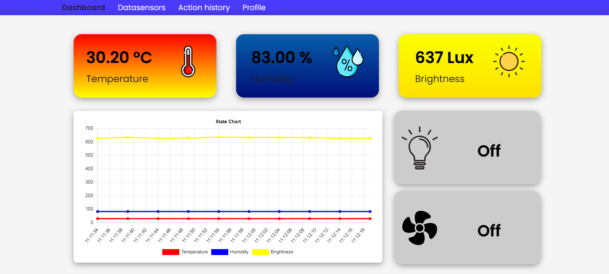
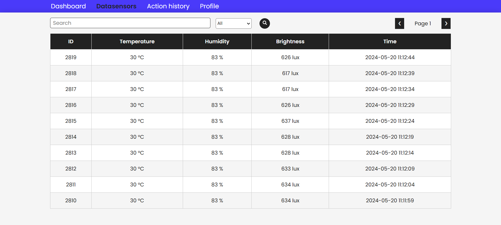
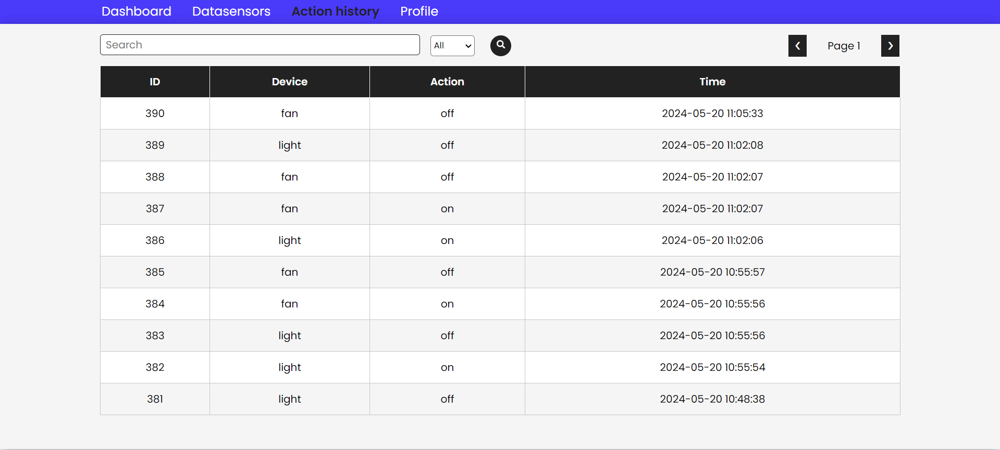
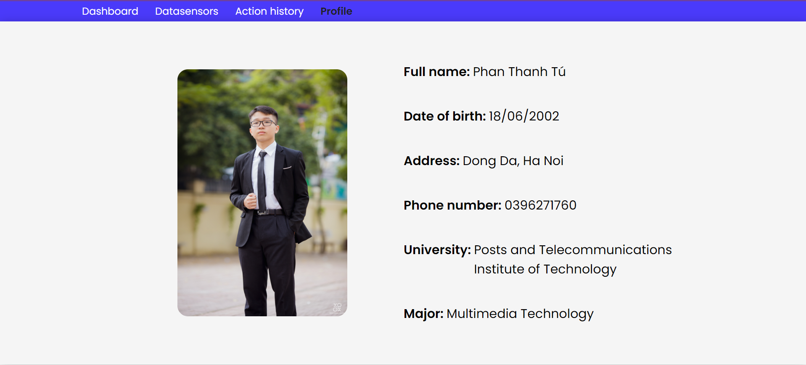

# IOT WEB

## Nội dung

<table>
      <tr>
        <td valign="top">
          <ul>
            <li><a href="#1-tổng-quan">1. Tổng quan.</a></li>
            <li><a href="#2-cách-cài-đặt-dự-án">2. Cách cài đặt dự án.</a></li>
            <li><a href="#3-tài-liệu-và-tham-khảo">3. Tài liệu tham khảo.</a></li>
          </ul>
        </td>
      </tr>
</table>

## 1. Tổng quan

Dự án web app IoT sử dụng mạch Esp8266 để quản lý nhiệt độ, độ ẩm, ánh sáng cùng một số chức năng bật/tắt đèn và quạt.

Các chức năng chính:

- **Hiển thị dữ liệu từ hardware**: Tất cả các dự liệu từ `hardware` sẽ được chuyển đến `server (NodeJS)` thông qua `MQTT broker` để xử lý sau đó sẽ lưu lại vào `database (Sql sever)`. Xong, `server` sẽ cung cấp các `api` để cho `client(ReactJS)` hiển thị.
- **Bật/tắt đèn, quạt**: `Người dùng` sẽ thực hiện hành động bật đèn trên `client` sau đó `client` sẽ gọi đến `server`. `Server` sẽ kết nối `MQTT broker` để thực hiện hành động bật đèn và trả về dự liệu cho `server`. `Server` trả dữ liệu cho client để client hiển thị.

## 2. Cách cài đặt dự án

### Bước 1: Clone dự án ở repo

Lấy source code từ trên github về máy.

```
git clone https://github.com/tuphan1806/IOT_WEB.git
```

### Bước 2: Cài các dependencies

Front-end

```
cd IOT_WEb/frontend
npm i
```

Back-end

```
cd IOT_WEB/backend
npm i
```

### Bước 3: Chạy dự án

Front-end

```
cd IOT_WEb/frontend
npm run dev
```

Back-end

```
cd IOT_WEB/backend
npm run dev
```

### Dự án sau khi chạy

#### Server

Truy cập vào địa chỉ: [https://documenter.getpostman.com/view/33602546/2sA3QmDuXS) để xem API document của Server


#### Client

Trang dashboard:



Trang dữ liệu cảm biến:



Trang lịch sử bật tắt đèn:



Trang profile:



## 3. Tài liệu và tham khảo

### Tài liệu tham khảo

- Cài node js tại: [Nodejs](https://nodejs.org/en).
- Cài đặt arduino tại: [Arduino](https://www.arduino.cc/en/software)
- Cài đặt Mqtt tại: [Mosquitto](https://mosquitto.org/download/)
- Kiến thức về hardware: [From Zero to Smart Home Hero: Automate Your Life with NodeMCU and MQTT](https://youtu.be/qdxKUQEgDNE?si=jq4B2je0GqNbf6Yp)
- Cách MQTT broker: [Cài đặt Local MQTT Broker trên Windows #1](https://www.youtube.com/watch?v=xLLFrLhegcw)
- Bảo mật MQTT brokder với username, password: [Setting up User name and password for Mosquitto Mqtt Broker](https://www.youtube.com/watch?v=fknowuQJ9MA).
